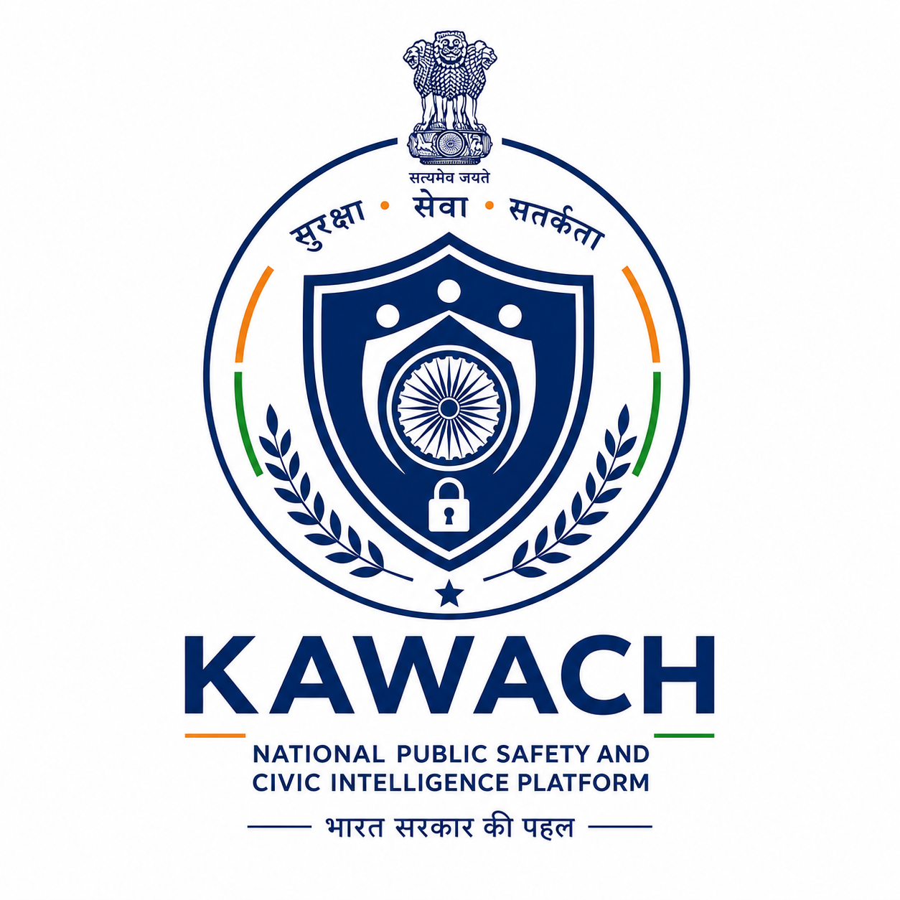

<p align="center">
  
</p>

# 🛡️ CrimeSafe (KAWACH) — AI-Powered Criminal Network & Intelligence Discovery System

### **Smart India Hackathon (SIH) 2026 — Problem Statement 189**
> **Theme:** Artificial Intelligence (AI), Machine Learning (ML), Natural Language Processing (NLP) & Graph Analytics for Law Enforcement & Intelligence Agencies

---

## 📌 Problem Statement 189 Overview

### **Background**
Modern criminal activities are increasingly organized, covert, and interconnected. Criminals operate across syndicates involving associates, intermediaries, financial channels (Hawala, money mules, fraudulent UPIs), communication links (CDRs, burner SIMs), locations, and physical/digital events. Law enforcement and intelligence agencies collect massive volumes of data:
- **FIRs & Police Reports** (Unstructured text, multi-lingual narratives)
- **Call Detail Records (CDRs)** & Tower Dumps (Telecommunication links, IMEI sharing)
- **Financial Transaction Records** (Bank statements, UPI, crypto trails, shell companies)
- **Surveillance & CCTV Feeds** (Facial recognition, vehicle tracking)
- **Social Media & Open-Source Intelligence (OSINT)**
- **Criminal History Databases & Gang Registries**
- **Intelligence Agency Reports & Interception Logs**

**The Investigative Bottleneck:** Data remains fragmented across isolated silos. Manual correlation across millions of records is labor-intensive, slow, and prone to missing hidden connections between key organizers and low-level operatives.

### **Objective & Expected Solution**
An end-to-end, AI-powered system that automatically analyzes structured and unstructured multi-source criminal data to:
1. **Ingest & Extract Multi-Source Entities**: Identify Persons, Aliases, Phone Numbers, IMEIs, Bank Accounts, UPI IDs, Vehicles, Locations, and Organizations.
2. **Build Knowledge Graphs & Relationship Maps**: Construct multi-layered graph relationships across suspects, communications, and money flows.
3. **Pinpoint Key Influencers & Syndicate Kingpins**: Use Graph Centrality, Betweenness, and PageRank to unmask hidden organizers behind mule networks.
4. **Detect Suspicious Patterns & Anomalies**: Spot money-mule loops, burner phone networks, co-location clusters, and organized fraud syndicates.
5. **Equip Investigators with Actionable Visual Intelligence**: Interactive graph exploration, automated suspect dossiers, BNS/BNSS legal citations, and predictive link analysis.

---

## 🚀 System Architecture & Capabilities Mapping

```
┌────────────────────────────────────────────────────────────────────────────────────────┐
│                               MULTI-SOURCE DATA INGESTION                              │
│  [FIRs & Reports]  [CDRs / Tower Logs]  [Bank/UPI Records]  [CCTV / Faces]  [OSINT/Web] │
└───────────────────────────────────────────┬────────────────────────────────────────────┘
                                            │
                                            ▼
┌────────────────────────────────────────────────────────────────────────────────────────┐
│                             AI & NLP EXTRACTION PIPELINE                               │
│  • Entity Extraction (NER): Suspects, Phone Numbers, Bank/UPI, Vehicles, Geo-Locations │
│  • Multimodal Analysis: Deepfake/Audio Spoof Check, Currency Verification, OCR          │
│  • Legal Intelligence (RAG): Bharatiya Nyaya Sanhita (BNS), BNSS, IT Act Mapping        │
└───────────────────────────────────────────┬────────────────────────────────────────────┘
                                            │
                                            ▼
┌────────────────────────────────────────────────────────────────────────────────────────┐
│                        KNOWLEDGE GRAPH & GRAPH ANALYTICS ENGINE                         │
│  • Graph Construction: Nodes (Entities) & Edges (Transactions, Calls, Co-occurrences)  │
│  • Syndicate Detection: Louvain Community Detection, Money-Mule Ring Isolation         │
│  • Kingpin Identification: Eigenvector, Betweenness & Degree Centrality Scoring        │
│  • Spatial-Temporal Analytics: DBSCAN Crime Hotspot & Geo-Temporal Co-location         │
└───────────────────────────────────────────┬────────────────────────────────────────────┘
                                            │
                                            ▼
┌────────────────────────────────────────────────────────────────────────────────────────┐
│                         INVESTIGATOR COMMAND & COPILOT CONSOLE                         │
│  • 3D/2D Force Graph Explorer & Suspect Dossiers                                       │
│  • AI Copilot ("Nayak"): Natural Language Graph Queries & Evidence Correlation          │
│  • Real-Time Threat Alerts & Automated Statutory Complaint Dispatch                    │
└────────────────────────────────────────────────────────────────────────────────────────┘
```

---

## 🎯 Direct Alignment with PS 189 Requirements

| PS 189 Requirement | Implemented Solution | Module / Source Location |
|---|---|---|
| **Multi-Source Data Ingestion** | Ingestion pipeline for FIR transcripts, CDR logs, financial audit trails, CCTV frames, and citizen fraud reports. | `police/backend/app/routes/ingestion.py`, `police/backend/app/routes/reports.py` |
| **Named Entity Extraction (NER)** | Transformer-based NLP & regex pipelines extracting suspects, aliases, phone numbers, UPI/bank accounts, vehicles, and geo-locations from raw narratives. | `Classifier/app/`, `police/backend/app/routes/digital_arrest.py` |
| **Knowledge Graph & Relationship Mapping** | Graph database engine constructing multi-modal relationship graphs (Suspect ↔ Phone ↔ Bank Account ↔ Co-Accused ↔ Location). | `police/backend/app/routes/network.py`, Neo4j / NetworkX graph engine |
| **Influencer & Kingpin Identification** | Algorithmic centrality scoring (Betweenness, Degree, PageRank, Closeness) and Louvain community clustering to unmask ringleaders. | `police/backend/app/routes/network.py`, `police/frontend/src/components/NetworkView.jsx` |
| **Suspicious Pattern & Anomaly Detection** | DBSCAN spatial clustering, Hawala/mule account cycle detection, transaction burst monitoring, and digital arrest scam-script matching. | `police/backend/app/routes/geo.py`, `police/backend/app/routes/digital_arrest.py` |
| **Investigator AI Copilot & Visual Insights** | Interactive graph canvas with filterable entity pivots, automated case dossiers, and an AI legal assistant ("Nayak") with Indian Legal Corpus RAG. | `police/frontend/src/components/AICopilotView.jsx`, `standardized_rulebook/` |

---

## 🧩 Key Modules & Tech Stack

### 1. Police Command & Network Intelligence Console (`police/`)
- **Frontend (`police/frontend/` & `user/src/components/department/police/`):** React 19, Vite, Tailwind CSS, Lucide Icons, Canvas/D3/Force-Graph visualizers.
- **Backend (`police/backend/`):** FastAPI, Python 3.11, NetworkX / Neo4j Graph DB, PostgreSQL / Supabase, Pydantic.
- **Features:** Real-time crime feed, syndicate graph analysis, DBSCAN hotspot maps, automated suspect dossier generation, AI Copilot case search.

### 2. Multi-Modal AI Classifier Microservice (`Classifier/`)
- **Stack:** FastAPI, PyTorch, torchvision, EfficientNet-B0/B7, MTCNN, YOLO.
- **Capabilities:**
  - Deepfake & audio manipulation verification for digital impersonation / cyber arrest extortion.
  - Counterfeit currency physical & serial integrity verification pipeline.
  - Priority & threat classification using DistilBERT.

### 3. Legal Intelligence & Statutory Knowledge Base (`standardized_rulebook/`)
- Comprehensive parsed corpus of Indian law for precise statutory mapping and charge-sheeting:
  - Bharatiya Nyaya Sanhita (**BNS**)
  - Bharatiya Nagarik Suraksha Sanhita (**BNSS**)
  - Bharatiya Sakshya Adhiniyam (**BSA**)
  - Information Technology Act (**IT Act**), Prevention of Corruption Act, IPC crosswalks.

### 4. Citizen Shield & Ingestion Portal (`user/`)
- Multi-channel PWA for rapid scam reporting, evidence capture, community safety feed, and conversational crime reporting in 12 regional languages.

---

## 🛠️ Quick Start & Setup

### Prerequisites
- Python 3.10+
- Node.js 18+ and npm
- PostgreSQL (or Supabase instance)
- Optional: Neo4j 5+ (system defaults to in-memory graph analytics fallback if unavailable)

### 1. Run the Police Intelligence Backend
```bash
cd police/backend
pip install -r requirements.txt
python -m uvicorn app.main:app --host 0.0.0.0 --port 8000 --reload
```

### 2. Run the AI Classifier Microservice
```bash
cd Classifier
pip install -r requirements.txt
python -m uvicorn app.main:app --host 0.0.0.0 --port 8001 --reload
```

### 3. Run the Police Intelligence & Command Frontend
```bash
cd user
npm install
npm run dev -- --port 5175
```

---

## 🔬 AI/ML & Graph Analytics Methodology

- **Trained & Deployed Neural Models:**
  - MTCNN + Dual EfficientNet-B7 ensemble for deepfake / synthetic media detection.
  - EfficientNet-B0 CNN for currency counterfeit analysis (91.9% accuracy across 6.3k images).
  - DistilBERT fine-tuned for priority classification and incident severity triaging.
  - Gemini Pro / Flash LLM integration for multi-lingual conversational AI and report summarization.

- **Deterministic Graph & Spatial Algorithms:**
  - **Louvain Community Detection** for segmenting criminal cells and mule rings.
  - **Eigenvector & Betweenness Centrality** to isolate key facilitators and communication bridges.
  - **DBSCAN Clustering** for spatio-temporal crime series and contraband recovery mapping.

---

## 📜 Documentation & References
- [`docs/handover.md`](docs/handover.md) — System Architecture, Data Flow, and Production Deployment
- [`plan/kawach_build_spec.md`](plan/kawach_build_spec.md) — Comprehensive Engineering Specification
- [`Classifier/COUNTERFEIT_DETECTION.md`](Classifier/COUNTERFEIT_DETECTION.md) — Computer Vision Pipeline Deep Dive
- [`standardized_rulebook/`](standardized_rulebook/) — Standardized Indian Penal & Procedural Rulebook

---
*Built for **Smart India Hackathon 2026** — Advancing AI & Graph Intelligence for National Public Safety & Law Enforcement 🇮🇳*
